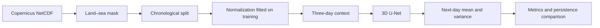

# Probabilistic Ocean State Forecasting

**Bachelor's thesis in Computer Engineering · University of Salento**

Arturo Marino · Supervisor: Prof. Italo Epicoco · Academic year 2025/2026

A **probabilistic 3D U-Net** takes three consecutive days of oceanographic data and predicts the following day's ocean state in the Mediterranean Sea. It estimates both the mean and uncertainty of temperature, salinity, and horizontal currents using Copernicus Marine reanalysis data.

**Explore the work:** [thesis PDF](tesi/main.pdf) · [LaTeX source](tesi/) · [execution guide (Italian)](docs/esecuzione.md)

## What the project does

- Loads NetCDF files lazily with Xarray and Dask and applies a land–sea mask.
- Splits the data chronologically and fits normalization statistics on the training set only.
- Builds three-day temporal windows and trains a 3D convolutional network with two output heads: mean and log-variance.
- Compares forecasts with **persistence**, which predicts the next day by copying the most recent available ocean state.
- Produces physical-unit metrics, learning curves, annual error maps, and LaTeX tables.

The project originated as a proposed generative extension of MedFormer. The submitted implementation is a probabilistic 3D U-Net forecaster; latent diffusion remains future work.

## Pipeline



| Component | Final experiment configuration |
| --- | --- |
| Predicted variables | `thetao_cglo` (temperature), `so_cglo` (salinity), `uo_cglo` and `vo_cglo` (currents) |
| Grid | 46 depth levels × 65 latitudes × 171 longitudes |
| Input | 3 days × 4 variables: `[B, 12, 46, 65, 171]` |
| Outputs | Mean and log-variance, each `[B, 4, 46, 65, 171]` |
| Training / validation / test | 1994–1997 / 1998 / 1999 |
| Objective | Masked Gaussian NLL + weighted MSE on the predicted mean |
| Model selection | Validation RMSE; v3 checkpoint selected at epoch 94 |

Sea surface height (`zos_cglo`) is handled by the data pipeline but is not one of the model's four predicted channels.

## Main results

Annual evaluation includes **364 forecasts** for each validation and test year, from January 2 to December 31. Days preceding the start of the year are used only as input context.

**MAE on the 1999 test set at a depth of 0.506 m** — values from the [complete thesis results table](tesi/chapter/annual-results-generated.tex):

| Variable | 3D U-Net | Persistence | Unit |
| --- | ---: | ---: | --- |
| Temperature | 0.27683 | **0.14564** | °C |
| Salinity | 0.07889 | **0.01896** | 10⁻³ |
| Zonal current `u` | 0.02686 | **0.02334** | m/s |
| Meridional current `v` | 0.02637 | **0.02382** | m/s |

Persistence achieves a lower surface MAE for all four variables. Across the full water column, the model slightly improves RMSE for both current components, while its MAE remains higher. The probabilistic outputs also allow the coverage of prediction intervals to be measured.

The figure shows **model MAE − persistence MAE**: positive values indicate larger model errors, while negative values indicate an improvement.


<details>
<summary>Learning curve of the final experiment</summary>


The history includes 96 completed epochs; the selected model is from epoch 94. Training metrics are recomputed with fixed weights after each epoch.

</details>

## Quick start

Verified environment: **Python 3.11**. PyTorch must be installed locally. Google Colab already provides it; keep the build supplied by that environment.

```bash
git clone https://github.com/arturomarino/thesis_repo.git
cd thesis_repo
python3 -m venv .venv
source .venv/bin/activate
python -m pip install torch
python -m pip install -r requirements-dev.txt
python -m pytest -q
```

The tests use small synthetic datasets and do not require the full dataset or trained checkpoints. To demonstrate the pipeline through a single training step:

```bash
python src/train.py --smoke-test-training
```

To use real data, prepare the following files:

```text
data/raw/copernicus.nc
data/masks/land_sea_mask.nc
data/processed/normalization_stats.nc  # compute or reuse compatible statistics
checkpoints/best_forecaster_v3.pt     # needed to evaluate the trained model
```

Datasets and checkpoints are stored outside the repository. The [execution guide (Italian)](docs/esecuzione.md) provides file references, local and Colab commands, training instructions, and steps to regenerate the results.

## Repository structure

```text
thesis_repo/
├── src/                    # Data pipeline, model, training, inference, and visualization
│   └── models/             # 3D U-Net and probabilistic autoencoder
├── tests/                  # Automated tests using synthetic data
├── tesi/                   # Single final thesis version: PDF, LaTeX, and figures
├── docs/esecuzione.md       # Execution guide and result reproduction (Italian)
├── data/                   # Local dataset, mask, and statistics (ignored by Git)
├── requirements.txt        # Pipeline dependencies; PyTorch managed separately
├── requirements-dev.txt    # Dependencies for running the tests
└── pytest.ini              # Test paths and collection settings
```

`outputs/` and `checkpoints/` are created during execution and excluded from Git. The figures and PDF in `tesi/` are the submission materials. Experiment details and checkpoint provenance limitations are documented in the [thesis notes (Italian)](tesi/README.md).
