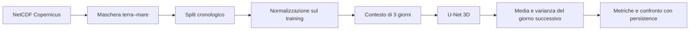
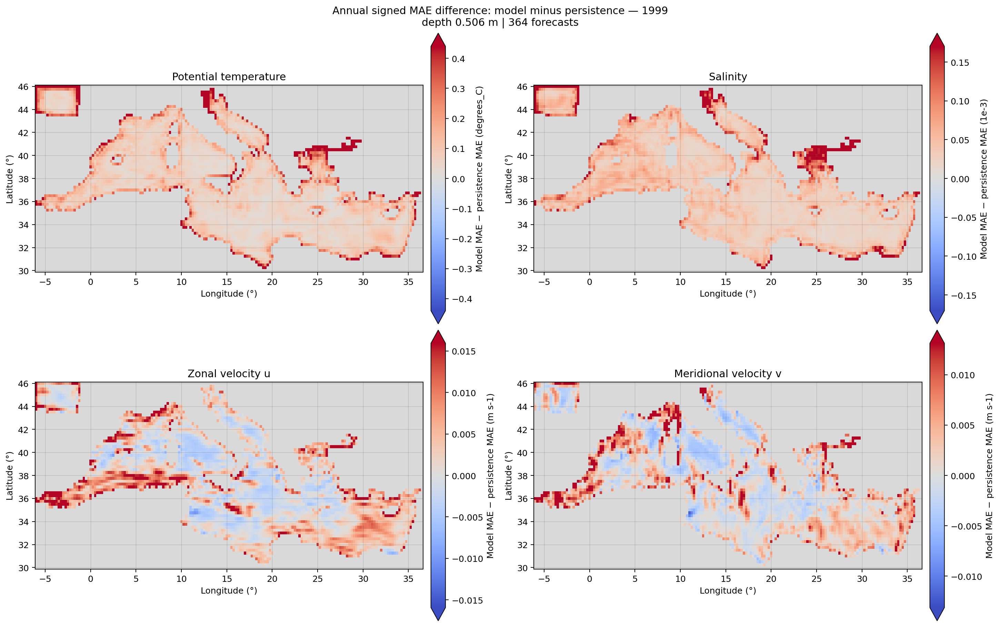
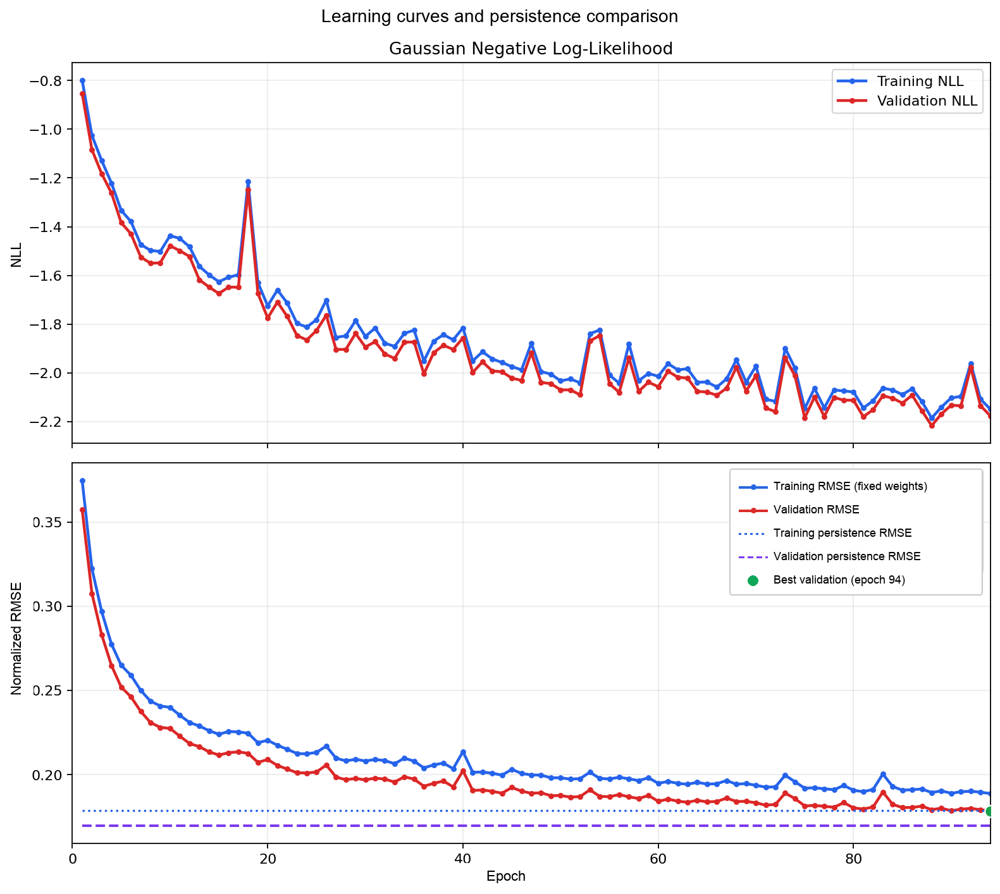

# Previsione probabilistica dello stato oceanico

**Tesi di laurea in Ingegneria Informatica · Università del Salento**

Arturo Marino · Relatore: Prof. Italo Epicoco · A.A. 2025/2026

Una **U-Net 3D probabilistica** riceve tre giorni consecutivi di dati oceanografici e prevede lo stato del giorno successivo nel Mediterraneo. Per temperatura, salinità e correnti orizzontali stima sia il valore medio sia l'incertezza, usando dati di rianalisi Copernicus Marine.

**Per consultare il lavoro:** [tesi in PDF](tesi/main.pdf) · [sorgenti LaTeX](tesi/) · [guida all'esecuzione](docs/esecuzione.md)

## Cosa fa il progetto

- Carica i NetCDF in modo lazy con Xarray e Dask, applicando la maschera terra–mare.
- Separa gli anni in ordine cronologico e calcola la normalizzazione sul solo training set.
- Costruisce finestre temporali di tre giorni e addestra una rete convoluzionale 3D con due uscite: media e log-varianza.
- Confronta le previsioni con la **persistence**, che usa lo stato dell'ultimo giorno disponibile come previsione del successivo.
- Produce metriche nelle unità fisiche, curve di apprendimento, mappe annuali e tabelle LaTeX.

Il lavoro nasce dall'idea di un'estensione generativa di MedFormer. La versione consegnata implementa il previsore probabilistico U-Net 3D; la latent diffusion resta uno sviluppo futuro.

## Pipeline



| Elemento | Configurazione dell'esperimento finale |
| --- | --- |
| Variabili previste | `thetao_cglo` (temperatura), `so_cglo` (salinità), `uo_cglo` e `vo_cglo` (correnti) |
| Griglia | 46 profondità × 65 latitudini × 171 longitudini |
| Ingresso | 3 giorni × 4 variabili: `[B, 12, 46, 65, 171]` |
| Uscite | Media e log-varianza, ciascuna `[B, 4, 46, 65, 171]` |
| Training / validation / test | 1994–1997 / 1998 / 1999 |
| Obiettivo | Gaussian NLL mascherata + MSE pesata sulla media |
| Selezione del modello | RMSE di validation; checkpoint v3 selezionato all'epoca 94 |

L'altezza della superficie marina (`zos_cglo`) è gestita dalla pipeline dati, ma non è uno dei quattro canali previsti dal modello.

## Risultati principali

La valutazione annuale comprende **364 previsioni** per ciascun anno di validation e test, dal 2 gennaio al 31 dicembre. I giorni precedenti all'inizio dell'anno servono soltanto come contesto.

**MAE sul test 1999, a 0,506 m di profondità** — valori dalla [tabella completa della tesi](tesi/chapter/annual-results-generated.tex):

| Variabile | U-Net 3D | Persistence | Unità |
| --- | ---: | ---: | --- |
| Temperatura | 0,27683 | **0,14564** | °C |
| Salinità | 0,07889 | **0,01896** | 10⁻³ |
| Corrente zonale `u` | 0,02686 | **0,02334** | m/s |
| Corrente meridionale `v` | 0,02637 | **0,02382** | m/s |

La persistence ottiene un MAE inferiore per tutte le variabili in superficie. Sull'intera colonna d'acqua, il modello migliora leggermente l'RMSE delle due correnti, pur mantenendo un MAE maggiore. Le uscite probabilistiche permettono inoltre di misurare la copertura degli intervalli di previsione.

La figura mostra **MAE del modello − MAE della persistence**: valori positivi indicano un errore maggiore del modello, valori negativi un miglioramento.



<details>
<summary>Curva di apprendimento dell'esperimento finale</summary>



La storia comprende 96 epoche completate; il modello scelto è quello dell'epoca 94. Le metriche di training sono ricalcolate a pesi fissi dopo ogni epoca.

</details>

## Avvio rapido

Ambiente verificato: **Python 3.11**. In locale serve PyTorch; in Google Colab è già disponibile e va mantenuta la build fornita dall'ambiente.

```bash
git clone https://github.com/arturomarino/thesis_repo.git
cd thesis_repo
python3 -m venv .venv
source .venv/bin/activate
python -m pip install torch
python -m pip install -r requirements-dev.txt
python -m pytest -q
```

I test usano piccoli dati sintetici e non richiedono il dataset completo o i checkpoint. Per una dimostrazione della pipeline fino a un passo di training:

```bash
python src/train.py --smoke-test-training
```

Per lavorare sui dati reali, predisporre:

```text
data/raw/copernicus.nc
data/masks/land_sea_mask.nc
data/processed/normalization_stats.nc  # da calcolare o riutilizzare
checkpoints/best_forecaster_v3.pt     # per valutare il modello già addestrato
```

Dataset e checkpoint sono esterni alla repo. La [guida all'esecuzione](docs/esecuzione.md) raccoglie i riferimenti ai file, i comandi locali e Colab, il training e la rigenerazione dei risultati.

## Struttura della repository

```text
thesis_repo/
├── src/                    # Dati, modello, training, inferenza e visualizzazioni
│   └── models/             # U-Net 3D e autoencoder probabilistico
├── tests/                  # Test automatici su dati sintetici
├── tesi/                   # Unica versione della tesi: PDF, LaTeX e figure
├── docs/esecuzione.md       # Guida operativa e riproduzione dei risultati
├── data/                   # Dataset, maschera e statistiche locali (ignorati da Git)
├── requirements.txt        # Dipendenze della pipeline; PyTorch gestito separatamente
├── requirements-dev.txt    # Dipendenze per eseguire i test
└── pytest.ini              # Percorsi e raccolta dei test
```

`outputs/` e `checkpoints/` vengono creati durante l'esecuzione e sono esclusi da Git. Le figure e il PDF in `tesi/` sono i materiali della consegna. I dettagli dell'esperimento e i limiti della provenienza del checkpoint sono documentati nella [tesi](tesi/README.md).
